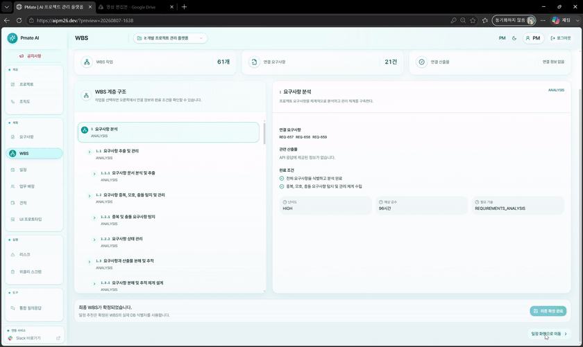
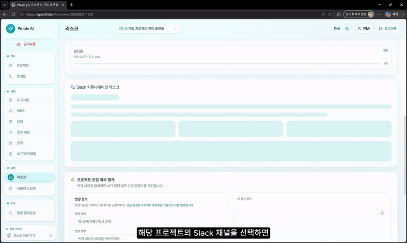
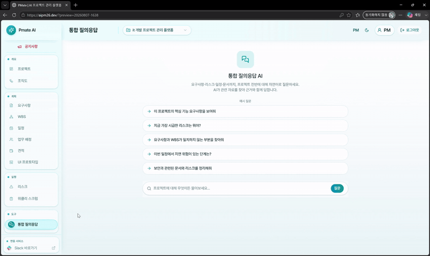

# PMate AI Server

> PMate의 요구사항 분석, 프로젝트 계획, 산출물 생성 지원, 리스크 분석과 보고서 초안을 담당하는 FastAPI 기반 AI Server

PMate AI Server는 Spring Boot Backend가 전달한 프로젝트 문서와 확정 데이터를 분석하고, 서비스에서 바로 사용할 수 있는 구조화된 JSON을 반환합니다. LLM이 잘하는 해석·생성과 서버가 보장해야 하는 검증·계산을 분리해 결과의 근거와 상태를 함께 전달합니다.

## Overview

PMate의 사용자는 Frontend에서 프로젝트 문서와 관리 데이터를 입력합니다. Backend는 파일과 프로젝트 컨텍스트를 이 서버의 REST API 계약에 맞춰 전달하고, AI Server는 도메인별 Graph 또는 Service를 실행한 뒤 Pydantic 응답 모델로 결과를 반환합니다. 생성 결과의 저장, 사용자 권한, 프로젝트 데이터 관리는 Backend가 담당합니다.

```text
PMate Frontend
      │
      │ 사용자 요청
      ▼
Spring Boot Backend ── multipart/form-data · JSON ──▶ FastAPI Router
      ▲                                                   │
      │                                                   ▼
      └──────────── 검증된 JSON 결과 ───────────── Domain Graph / Service
                                                          │
                                  ┌───────────────────────┴───────────────────────┐
                                  ▼                                               ▼
                       OpenAI Structured Output                         Deterministic Logic
                       문서 해석 · 생성 · 판단                    검증 · 계산 · 근거 연결 · Fallback
```

## AI Features

| 영역 | 입력 | 처리 | 주요 반환값 |
| --- | --- | --- | --- |
| Requirement Analysis | RFP, 제안서, 기획서 등 최대 10개 문서 | 텍스트/비전 문서 파싱, 분석 구간 선택, LLM 추출, 결과 병합 | 프로젝트 기본정보, 요구사항 후보, 필수 산출물, `llm_status` |
| Evidence & Readjustment | 문서와 기존 요구사항 | 문서·페이지·청크·인용문 근거 연결, 추가 문서와 기존 요구사항 비교 | 요구사항 근거, 추가·수정·삭제 후보, `PENDING_REVIEW` 상태 |
| WBS Generation | 확정 전 요구사항, 방법론, 필수 산출물 | `PHASE → WORK_PACKAGE → TASK` 생성, 누락 요구사항·산출물 재생성 | 계층형 WBS, 요구사항/산출물 커버리지, 경고 |
| Schedule Recommendation | WBS TASK와 프로젝트 기간 | LLM의 3점 기간·선행관계 추정 후 Monte Carlo 5,000회 계산 | 예상(P50)·권장(P80)·보수적(P90) 일정 |
| Resource Planning | WBS 일정, 역할·기술·숙련도·가용시간 | 역할·공수 추정과 서버 규칙 기반 담당자 추천 | TASK별 인일/MM, 필요 인력, 추천 담당자와 점수 근거 |
| Organization Chart | 인력 계획과 실제 프로젝트 멤버 | 검증된 조직 View 구성과 Pillow 렌더링 | 조직 구조 JSON, Base64 JPG, 크기 정보 |
| Cost & Effort | WBS별 MM, 단가·운영 조건 | 추가 비용 후보 분석, KOSA 직무·공수 추정, 서버 계산 | 권장 견적, 비용 상세, 직무별 인일/MM |
| Artifact Support | 요구사항, 조직/화면 정보, 등록 산출물 | UI Mockup 필요성 판단·JPG 생성, 산출물 보안/등록 상태 점검 | Base64 JPG, 탐지 결과, 누락·승인 상태 |
| Risk Analysis | 요구사항 변경, 일정/WBS, 팀원, 메시지 | 변경 영향, 재배정, 지연, 신호등, 커뮤니케이션 리스크 분석 | 위험 등급, 영향 TASK, 근거 메시지, 권고 조치 |
| Report Agent | 회의록, WBS, 리스크, 주간 스크럼, 산출물 본문 | 사실 기반 초안 생성, 기준문서 검토, PM 승인 결과 반영, 근거 검색 | 회의/주간/최종 보고서, 다음 업무, RAG 답변과 출처 |

문서 분석은 `.pdf`, `.hwp`, `.hwpx`, `.docx`, `.txt`, `.md`, `.csv`를 지원합니다. 텍스트가 없는 PDF는 Vision 분석 대상으로 분리합니다.

## Agent Architecture

`app/domains`는 기능별 Router, Schema, Graph, LLM Service, 결정론적 Service를 함께 관리합니다. 모든 도메인이 같은 방식으로 동작하는 것은 아닙니다.

| Domain | Orchestration | 핵심 흐름 |
| --- | --- | --- |
| `planning_documents` | LangGraph `StateGraph` | parse → split → 분석 입력 선택 → LLM/fallback 추출 → 근거 병합 → 응답 |
| `planning_wbs` | LangGraph `StateGraph` + 조건 분기 | 컨텍스트 분할 → WBS 생성 → 커버리지 검사 → 누락 항목 보완 → 응답 |
| `planning_schedule` | LangGraph `StateGraph` | 기간·선행관계 추정 → 유효 관계 검사 → Monte Carlo 일정 계산 |
| `planning_resources` | LangGraph `StateGraph` | 역할·기술·인일 추정 → 가용시간과 숙련도 기반 배정 → 조직 View/이미지 생성 |
| `planning_costs` | LangGraph `StateGraph` | 추가 비용 후보 분석 → 입력 단가와 정책을 사용한 견적 계산 |
| `communication_risk` | LangGraph `StateGraph` | 메시지 지표 계산 → 선택적 LLM 판단 → 규칙 fallback → 근거 제한 응답 |
| `reporting` | `ReportGraph` facade + `ReportService` | 규칙 기반 사실 구조를 먼저 만들고 LLM이 요약·표현을 보강; PM 승인/거절을 최종 반영 |
| `project_risk` | Router + Agent/Service | 영향도 외에는 입력 데이터에 대한 규칙 기반 보안·지연·상태·신호등 분석 중심 |

`ReportGraph`는 도메인 진입점을 통일하는 facade이며 LangGraph의 `StateGraph`는 아닙니다. 이름만으로 모든 흐름을 LangGraph Agent라고 설명하지 않고, 실제 orchestration 경계를 구분했습니다.

## AI Processing Flow

1. Backend가 문서는 `multipart/form-data`, 나머지 분석 컨텍스트는 JSON으로 전달합니다.
2. FastAPI와 Pydantic이 ID, enum, 날짜, 계층 관계, 중복과 범위를 검증합니다.
3. Domain Graph가 LLM 작업과 결정론적 작업을 순서대로 실행합니다.
4. OpenAI `responses.parse` 또는 `ChatOpenAI.with_structured_output`이 Pydantic 모델에 맞는 결과를 생성합니다.
5. 서버 로직이 실제 입력 ID만 허용하고, WBS 커버리지·선행관계·금액·일정·담당자 점수를 다시 계산합니다.
6. 결과와 `llm_status`를 Backend에 반환하며, Backend가 프로젝트 데이터로 저장하고 Frontend에 제공합니다.

## Demo

### 요구사항 분석

업로드 문서를 분석해 구조화된 요구사항을 만들고, 사용자가 목록과 상세 카드를 검토할 수 있도록 반환합니다.

<p align="center">
  
</p>

### 일정 시나리오 생성

WBS 선후 관계와 기간을 분석해 예상·권장·보수 시나리오를 만들고 Gantt Chart로 확인할 수 있는 결과를 반환합니다.

<p align="center">
  
</p>

### 커뮤니케이션 리스크 분석

Backend가 전달한 프로젝트 메시지를 근거로 위험 신호를 분석하고 등급·근거·권고 조치를 구조화합니다.

<p align="center">
  
</p>

### 근거 기반 프로젝트 질의응답

등록 문서와 산출물을 검색해 답변과 출처를 함께 생성합니다.

<p align="center">
  
</p>

## Backend API Contract

Backend의 `PlanningAgentProperties`와 AI HTTP Client가 아래 경로를 사용합니다. AI Server는 사용자 인증이나 파일 저장을 직접 처리하지 않고, Backend가 준비한 프로젝트 컨텍스트를 분석하는 내부 API 역할을 맡습니다.

| API Group | Endpoints | Request |
| --- | --- | --- |
| Health | `GET /health` | - |
| Documents | `POST /api/v1/planning/documents/extract`<br>`POST /api/v1/planning/documents/readjust` | multipart files + JSON form fields |
| WBS / Schedule | `POST /api/v1/planning/wbs/generate`, `/api/v1/planning/schedules/recommend` | JSON |
| Resources | `POST /api/v1/planning/resources/recommend`<br>`POST /api/v1/planning/resources/organization-chart/generate`<br>`POST /api/v1/planning/resources/organization-chart/render` | JSON |
| UI Mockup | `POST /api/v1/planning/ui-mockup/assess`<br>`POST /api/v1/planning/ui-mockup/generate` | JSON |
| Cost / Effort | `POST /api/v1/planning/costs/estimate`<br>`POST /api/v1/planning/costs/effort-estimate` | JSON |
| Risk | `POST /api/v1/risk/communication/analyze`<br>`POST /api/v1/risk/impact-assessment`<br>`POST /api/v1/risk/assignee-reassignment`<br>`POST /api/v1/risk/artifact-security`<br>`POST /api/v1/risk/artifact-status`<br>`POST /api/v1/risk/member-delay`<br>`POST /api/v1/risk/schedule-wbs-risk` | JSON |
| Reports | `POST /api/v1/reports/meeting/analyze`<br>`POST /api/v1/reports/weekly/generate`<br>`POST /api/v1/reports/final/generate`<br>`POST /api/v1/reports/deliverables/rag/query`<br>`POST /api/v1/reports/weekly-scrum/summarize`<br>`POST /api/v1/reports/weekly-scrum/review`<br>`POST /api/v1/reports/weekly-scrum/recommend-next-actions`<br>`POST /api/v1/reports/weekly-scrum/finalize` | JSON |

공통 HTTP 계약은 모든 응답에 `X-Request-ID`를 추가합니다. 검증 오류와 AI upstream 오류는 다음 형태로 통일하며 OpenAPI에도 `400`, `413`, `422`, `502`, `503`, `504` 응답을 명시합니다.

```json
{
  "code": "VALIDATION_ERROR",
  "message": "Request validation failed.",
  "request_id": "backend-request-123",
  "retryable": false,
  "details": []
}
```

커뮤니케이션 분석도 AI Server가 Slack에 직접 접속하지 않습니다. 메시지 수집·프로젝트 매핑·결과 저장은 Backend 책임이며, AI Server는 전달받은 `messages[]`만 분석합니다.

## Reliability

- **Structured Output**: WBS, 일정, 인력, 비용, 영향도는 OpenAI Structured Output과 Pydantic 모델을 함께 사용합니다. 문서·커뮤니케이션 분석도 LangChain의 구조화 출력을 사용합니다.
- **Evidence**: 요구사항은 `document_id`, 페이지, 청크, 인용문, offset 또는 bounding box를 보존합니다. RAG와 주간 스크럼 검토 결과도 출처 ID와 근거 문장을 반환합니다.
- **Deterministic Post-processing**: LLM이 제안한 ID와 관계를 그대로 신뢰하지 않고, 실제 TASK 존재 여부, WBS 커버리지, 선행관계, 조직 구성, 비용과 일정 값을 서버에서 검증·계산합니다.
- **Fallback Boundary**: 문서 추출, 커뮤니케이션 리스크, 변경 영향도, 보고 도메인은 API Key 부재나 LLM 실패 시 규칙 기반 결과와 `SKIPPED_NO_API_KEY`, `FALLBACK`, `DISABLED` 상태를 반환할 수 있습니다. WBS·일정·인력·견적·UI Mockup 생성은 LLM이 필수이므로 설정 오류는 `503`, 생성 실패는 `502`로 반환합니다.
- **Human Review**: 요구사항 변경 후보는 `PENDING_REVIEW`로 반환하고, 주간 보고서는 PM이 `APPROVED` 또는 `MODIFIED`한 검토 결과만 최종 본문에 포함합니다.
- **Bounded Document Analysis**: 파일 수·크기, 분석 청크 수, timeout을 제한하고 선택되지 않은 청크는 결정론적 추출로 보완합니다.
- **Network-isolated Test**: CI는 빈 `OPENAI_API_KEY`로 단위·통합 테스트를 실행하고 별도 network guard로 외부 호출이 발생하지 않는지 검사합니다.

## Tech Stack

| Category | Technology |
| --- | --- |
| Runtime | Python 3.11 |
| API | FastAPI 0.139.0, Uvicorn 0.51.0 |
| Agent Orchestration | LangGraph 1.2.9 |
| LLM | OpenAI SDK 2.46.0, LangChain OpenAI 1.3.5 |
| Validation | Pydantic 2.13.4 |
| Document Processing | PyMuPDF, pypdf, python-docx, olefile |
| Rendering | Pillow, Noto Sans CJK |
| Persistence Support | SQLAlchemy 2.0.51, SQLite-based project risk models/services |
| Test / Delivery | `unittest`, FastAPI TestClient, GitHub Actions, systemd, EC2 |

## Project Structure

```text
app/
├── core/
│   ├── api_types.py              # 공통 ID·LLM 상태 타입
│   └── http/                     # Request ID, 공통 오류, OpenAPI 계약
├── domains/
│   ├── planning_documents/       # 문서·요구사항·Evidence·재조정
│   ├── planning_wbs/             # WBS 생성과 커버리지 보완
│   ├── planning_schedule/        # 일정 추정과 Monte Carlo 계산
│   ├── planning_resources/       # 인력 추천·조직도·UI Mockup
│   ├── planning_costs/           # 견적·KOSA 공수
│   ├── communication_risk/       # 메시지 기반 커뮤니케이션 리스크
│   ├── project_risk/             # 영향도·지연·산출물·보안 리스크
│   └── reporting/                # Report Agent·RAG·주간 스크럼
└── main.py                       # FastAPI 생성과 Router 조립

tests/
├── api/                          # OpenAPI·Backend 계약
├── domains/                      # Schema·Graph·Router·Service 단위 테스트
├── integration/                  # Planning·Reporting 파이프라인
├── e2e_stub/                     # Backend 연동용 결정론적 문서 분석 Stub
└── operations/                   # 배포 파일과 runtime layout 검증
```

## Local Development

```powershell
python -m venv .venv
.\.venv\Scripts\python.exe -m pip install -r requirements.txt
```

프로젝트 루트에 `.env`를 만들고 OpenAI 설정을 입력합니다.

```env
OPENAI_API_KEY=your-api-key
OPENAI_MODEL=gpt-4.1-mini
```

조직도와 UI Mockup을 렌더링하는 서버에서는 한글을 지원하는 폰트 경로를 설정할 수 있습니다.

```env
ORG_CHART_FONT_PATH=/absolute/path/to/NotoSansCJK-Regular.ttc
```

```powershell
.\.venv\Scripts\python.exe -m uvicorn app.main:app --reload --host 127.0.0.1 --port 8000
```

- Swagger UI: <http://127.0.0.1:8000/docs>
- Health Check: <http://127.0.0.1:8000/health>

## Test

```powershell
.\.venv\Scripts\python.exe -m unittest discover -v
.\.venv\Scripts\python.exe -m compileall -q app tests
.\.venv\Scripts\python.exe -m pip check
.\.venv\Scripts\python.exe tests/network_guard_runner.py
```

테스트는 Schema 경계값, Graph node 연결, LLM 응답 parsing/fallback, Router 계약, Evidence 보존, 일정·인력·비용 계산, Report Agent의 PM 승인 규칙, 배포 runtime을 포함합니다. 외부 API 호출은 mock 또는 deterministic stub으로 대체합니다.

## CI/CD & EC2 Deployment

```text
Pull Request → AI CI → unittest · compileall · pip check · network guard

main Push → Test → Source Archive → SCP to EC2 → deploy.sh
          → release별 venv 검증 → source/venv/revision 백업
          → systemd 재시작 → 127.0.0.1:8090/health → 실패 시 자동 복구
```

- `.github/workflows/ai-ci.yml`은 `main` 대상 PR에서 Python 3.11 테스트와 Bash 문법 검사를 수행합니다.
- `.github/workflows/ai-main-deploy.yml`은 `main` push 후 테스트를 다시 수행하고 secrets·runtime data·`sample_data`를 제외한 archive만 기존 EC2로 전송합니다.
- `aipm-ai-server.service`는 `/etc/aipm/ai-server.env`를 읽고 loopback `127.0.0.1:8090`에서 Uvicorn worker 1개를 실행합니다.
- `deploy.sh`는 release별 virtualenv를 먼저 검증한 뒤 현재 source와 `.venv`를 교체합니다. 실패하면 source, dependency, revision을 함께 복구합니다.
- `rollback.sh`는 최근 backup 또는 지정 backup으로 수동 복구하며, `health-check.sh`가 배포 성공 여부를 확인합니다.

## Team & Related Repositories

- [PMate Frontend](https://github.com/Aivle-26/frontend-repo)
- [PMate Backend](https://github.com/Aivle-26/backend-repo)
- [Aivle-26 Organization](https://github.com/Aivle-26)
- [PMate Service](https://aipm26.dev)

팀 구성과 역할은 [Aivle-26 Organization](https://github.com/Aivle-26)에서 확인할 수 있습니다.

## License

[MIT License](./LICENSE)
